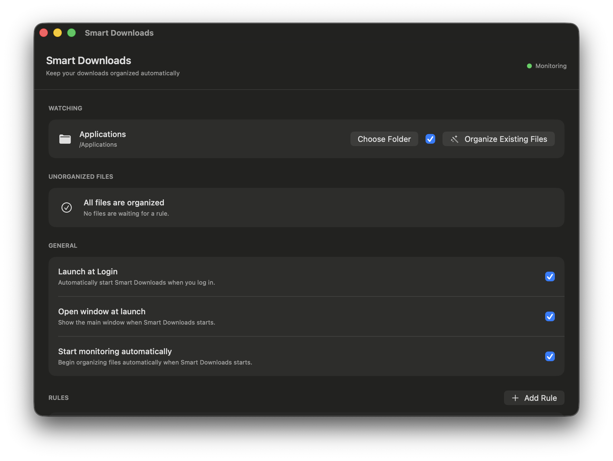

  

<h1 align="center">Smart Downloads</h1>

  A smart file organizer for macOS that automatically keeps your folders clean.

  
  
  
  

  Smart Downloads automatically monitors a folder and organizes new files using customizable rules.
   
  Everything happens locally on your Mac.

  

## Features

- Automatic folder monitoring
- Built-in organization rules
- Custom rules
- Organize existing files
- Unorganized file detection
- Rule conflict resolution
- Multiple destinations
- Undo file operations
- Recent activity
- Launch at Login
- Menu bar mode
- macOS notifications

## Requirements

- macOS 15 or later
- Apple Silicon or Intel Mac

## Download

Smart Downloads 1.0 is coming soon.

## Privacy

Smart Downloads works locally on your Mac.

Your files are not uploaded to external servers and no account is required to use the app.

## Support

Smart Downloads is free to use.

If you find it useful, you will be able to support continued development.

## License

Copyright © 2026 Maxim Petrov. All rights reserved.
